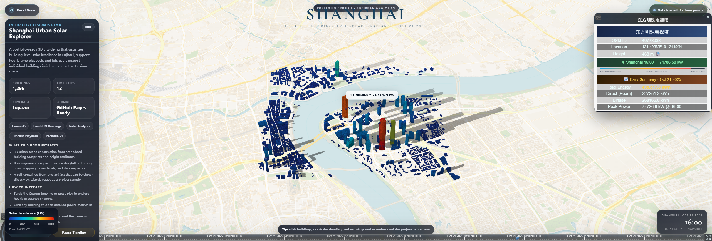
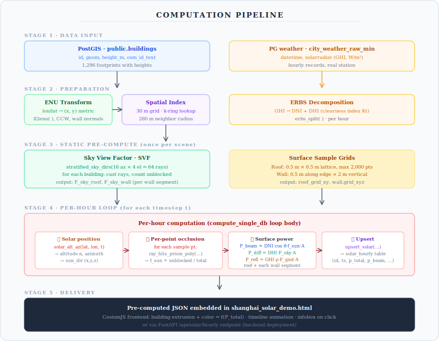
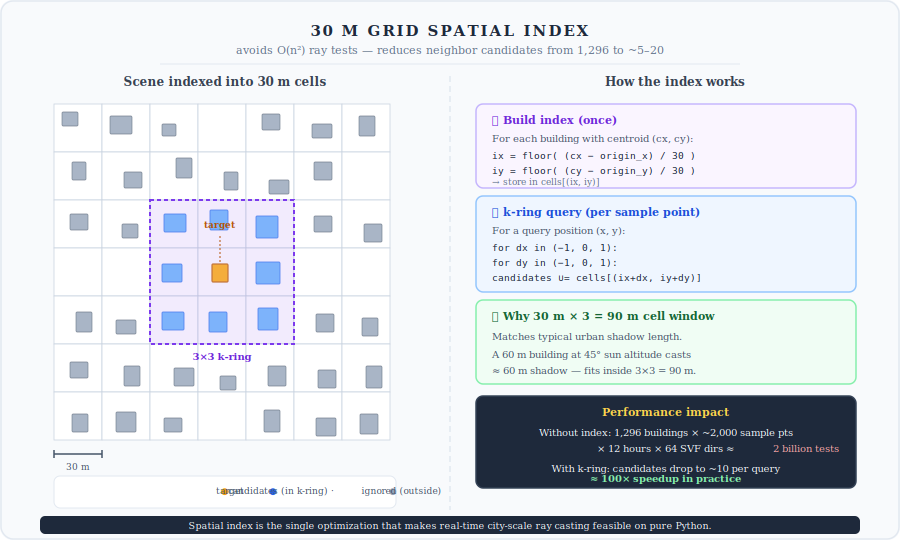
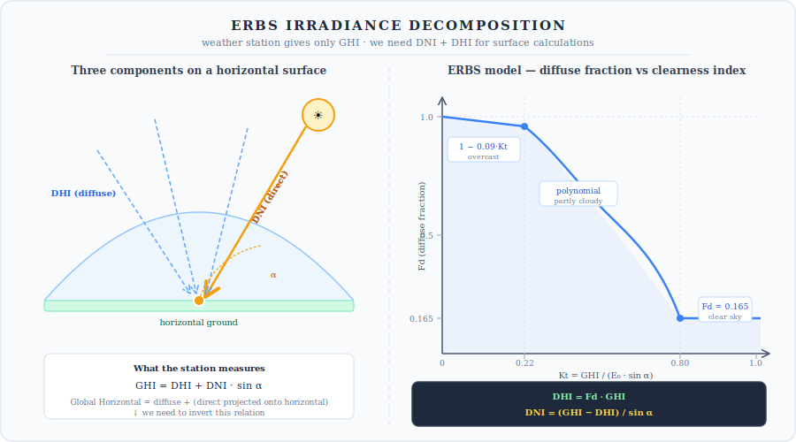
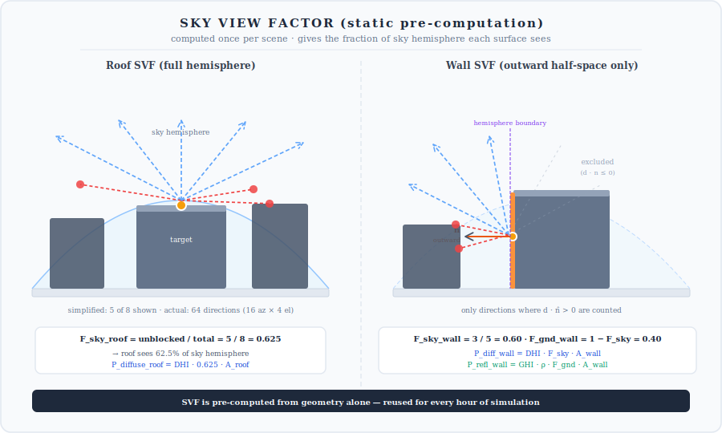
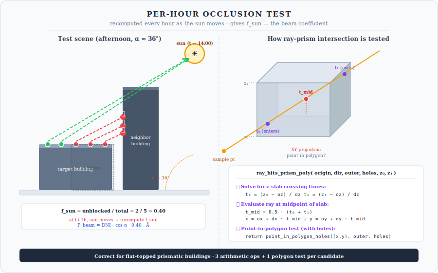
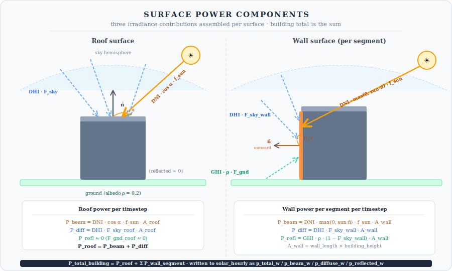

# Urban Solar Explorer

A city-scale building-level solar irradiance solver with interactive 3D visualization. Computes per-surface beam / diffuse / reflected power under real weather data, accounting for mutual building shading via ray-casting occlusion.



**[▶ Open Live Demo](https://zilongliu1999.github.io/Urban-Solar-Explorer/shanghai_solar_demo.html)** — Lujiazui, Shanghai (1,296 OSM buildings) as example dataset.

The solver itself is location-agnostic: any city with OSM building data and a local GHI weather record can be dropped in.

---

## Overview

The core question this project answers is: *given a real urban environment with mutual shading between buildings, how much solar irradiance does each building surface actually receive at each hour of the day?*

This matters because buildings cast shadows on each other — a low-rise building next to a skyscraper receives very different radiation than the same building in an open field. A physically meaningful answer requires geometry-based occlusion for every surface sample point, at every hour.

The solver handles this end-to-end: reads building geometry from PostGIS, splits measured GHI into direct and diffuse components (ERBS), pre-computes sky view factors, casts occlusion rays at each timestep, and writes per-building hourly power back to the database. The CesiumJS frontend reads these results and maps each building to a color on a blue→yellow→red scale, updating as the timeline advances.

This repository contains the **self-contained demo HTML** with pre-computed results for one day baked in — the full backend solver lives in a private repository.

---

## Running the demo

```bash
git clone https://github.com/zilongliu1999/Urban-Solar-Explorer.git
cd Urban-Solar-Explorer
python -m http.server 8000
# → http://localhost:8000/shanghai_solar_demo.html
```

Or just open `shanghai_solar_demo.html` directly in a browser (some browsers may restrict local file access; the local server is more reliable).

---

## Computation pipeline

The solver is structured in five stages: data input → geometric preparation → static pre-compute (SVF + sample grids) → per-hour loop (solar position → occlusion → power) → delivery.



---

## Algorithm details

### 1. Coordinate system

All geometry is converted from WGS-84 lon/lat to a local East-North-Up (ENU) Cartesian frame centred on the scene centroid. This allows direct metric distance and normal vector calculations without spherical corrections.

```python
def ll2enu(lat0, lon0, lat, lon):
    x = (lon - lon0) * DEG * R_EARTH * cos(lat0 * DEG)
    y = (lat - lat0) * DEG * R_EARTH
    return (x, y)
```

Building polygons are reprojected, CCW orientation enforced, wall outward normals computed as `n = (edge_y, -edge_x) / |edge|` per segment.

### 2. 30 m grid spatial index

Ray-casting against all buildings for every sample point would require billions of intersection tests at city scale. A simple 30 m grid index reduces this by orders of magnitude — only nearby candidates are considered.



Each building is bucketed by its centroid into a cell `(ix, iy) = (⌊(cx−origin)/30⌋, ⌊(cy−origin)/30⌋)`. A query at position `(x, y)` retrieves only the 3×3 neighbourhood of cells — a "k-ring" of candidates. The cell size matches typical urban shadow length at mid-day sun angles.

### 3. Solar position

Sun altitude and azimuth are computed from first principles using low-precision VSOP87 approximations:

- **Julian Day** from Unix timestamp
- **Solar declination** via ecliptic longitude with equation-of-centre corrections
- **Equation of time** for apparent solar time
- **Hour angle** from true solar time at the site longitude
- **Altitude** from the spherical astronomy formula:

```
sin(alt) = sin(lat)·sin(dec) + cos(lat)·cos(dec)·cos(HA)
```

No external astronomy library is used. Accuracy is sufficient for irradiance simulation (< 0.1° error at typical solar angles).

### 4. ERBS irradiance decomposition

Weather stations typically record only Global Horizontal Irradiance (GHI). Direct Normal Irradiance (DNI) and Diffuse Horizontal Irradiance (DHI) must be separated for accurate surface calculations.



The ERBS model (Erbs, Klein & Duffie, 1982) uses the clearness index `Kt = GHI / (E0 · sin(α))` where `E0` is extraterrestrial irradiance and `α` is solar altitude:

```
if   Kt ≤ 0.22:  Fd = 1 − 0.09·Kt
elif Kt ≤ 0.80:  Fd = 0.9511 − 0.1604·Kt + 4.388·Kt² − 16.638·Kt³ + 12.336·Kt⁴
else:            Fd = 0.165

DHI = Fd · GHI
DNI = (GHI − DHI) / sin(α)
```

The diffuse fraction `Fd` transitions from near-1 (overcast — all diffuse) to 0.165 (clear sky — mostly direct). This avoids the physically unrealistic DNI spikes that appear at very low solar angles if GHI is used directly.

### 5. Sky View Factor — pre-computed once

SVF measures what fraction of the sky hemisphere is visible from a surface point, not blocked by surrounding buildings. It determines how much diffuse sky radiation the surface receives. SVF depends only on static geometry — computed once at startup and reused for every hour.



For each surface (roof centre, wall midpoint), rays are cast toward a stratified hemisphere of 16 azimuth × 4 elevation directions (64 directions total). The fraction that reach open sky without intersecting a neighbouring building prism is the SVF:

```python
def stratified_sky_dirs(n_az=16, n_el=4):
    for i in range(n_el):
        el = (i + 0.5) / n_el * (π/2)
        for j in range(n_az):
            az = (j + 0.5) / n_az * 2π
            yield (cos(el)·sin(az), cos(el)·cos(az), sin(el))
```

For walls, the hemisphere is restricted to directions where `d · n > 0` (outward-facing half-space), so only sky visible from the front of the wall is counted. The ground view factor is `F_gnd = 1 − F_sky_wall`.

### 6. Per-hour occlusion — recomputed each timestep

This is the core of the simulation: as the sun moves across the sky, every surface sample point must be tested to see whether the sun is blocked by a neighbouring building. The unblocked fraction `f_sun` directly scales the beam component.



For each sample point on the roof (or wall), a ray is cast from the point toward the sun direction. The ray is tested against every neighbouring building prism retrieved from the spatial index:

```python
def ray_hits_prism_poly(origin, direction, outer, holes, z0, z1):
    ox, oy, oz = origin;  dx, dy, dz = direction
    t0 = (z0 - oz) / dz
    t1 = (z1 - oz) / dz
    if t1 < t0: t0, t1 = t1, t0
    t0 = max(t0, 1e-6)
    if t1 < t0: return False              # ray behind the origin
    tmid = 0.5 * (t0 + t1)
    x = ox + dx * tmid
    y = oy + dy * tmid
    return point_in_polygon_holes((x, y), outer, holes)
```

The key insight is that for a flat-topped prismatic building, it's sufficient to check whether the ray passes through the building's z-slab (bottom `z0` to top `z1`) at any point inside its XY footprint. This reduces the problem to one point-in-polygon test per candidate.

If any ray hits any neighbour → occluded, point contributes nothing to beam. If clear → unblocked, point receives `DNI · cos(incidence)`.

```
f_sun = unblocked_points / total_points
```

### 7. Surface power assembly

For each hourly time step, the final power on each surface is the sum of three components:



**Roof:**
```
P_beam   = DNI · cos α · f_sun · A_roof
P_diff   = DHI · F_sky_roof · A_roof
P_refl   ≈ 0   (F_gnd_roof ≈ 0)
```

**Each wall segment:**
```
P_beam   = DNI · max(0, sun_dir · n_wall) · f_sun · A_wall
P_diff   = DHI · F_sky_wall  · A_wall
P_refl   = GHI · ρ · (1 − F_sky_wall) · A_wall
```

Where:
- `cos α = sun_dir[z]` — cosine of incidence on a horizontal roof
- `sun_dir · n_wall` — dot product with wall outward normal (clamped to 0)
- `f_sun` — unblocked fraction from the per-hour occlusion test
- `F_sky` — sky view factor from the SVF pre-computation
- `ρ = 0.2` — ground albedo (configurable)
- `A` — surface area in m²

The building total is the sum across roof and all wall segments:

```
P_total = P_roof + Σ P_wall_segment
```

---

## Backend architecture (not included in this repository)

The full solver pipeline uses:

- **PostgreSQL + PostGIS** for building footprints and hourly weather records
- **Pure Python solver** (no NumPy/SciPy, `math` only) implementing the algorithms above
- **FastAPI** service exposing `/api/buildings`, `/api/solar/hourly`, `/api/solar/compute-hour`, `/api/solar/compute-day`
- **CesiumJS frontend** for 3D visualization

The demo HTML bakes one day of pre-computed results into a self-contained file so it runs without any backend.

---

## Tech stack

| Layer | Detail |
|---|---|
| Solar engine | Pure Python, `math` only |
| Spatial backend | PostgreSQL + PostGIS |
| API | FastAPI |
| 3D scene | CesiumJS, extruded GeoJSON polygons |
| Demo delivery | Single self-contained HTML (~2 MB) |

---

## References

- Erbs, D.G., Klein, S.A., Duffie, J.A. (1982). *Estimation of the diffuse radiation fraction for hourly, daily and monthly-average global radiation.* Solar Energy, 28(4), 293–302.
- Meeus, J. (1998). *Astronomical Algorithms*, 2nd ed. Willmann-Bell.
